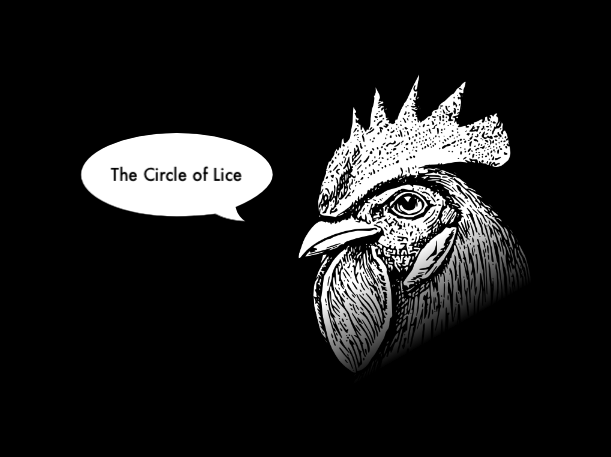

# Howard Chicken: The Screensaver.

[Howard Chicken](http://5by5.tv/b2w/126) flaps around reciting titles from the venerable [Back to Work](http://5by5.tv/b2w) podcast.

Based on AsteroidsQC by [Gary C. Martin](http://osx.garycmartin.com).

## Install

Copy `Howard.qtz` to `~/Library/Screen Savers`, or `/Library/Screen Savers` for system-wide use.

It should now be a listed under Screen Savers in System Preferences.

It's running on 10.10.1/Yosemite; older versions, ymmv.
